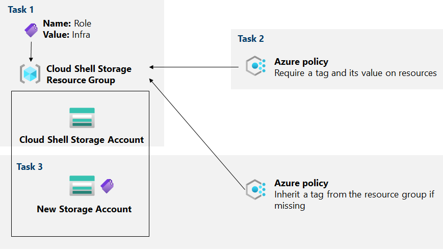
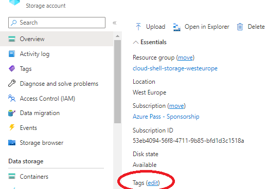
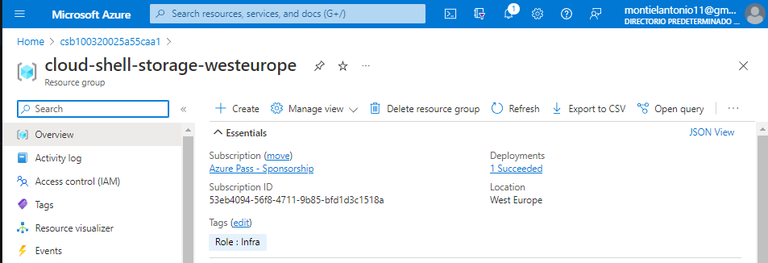
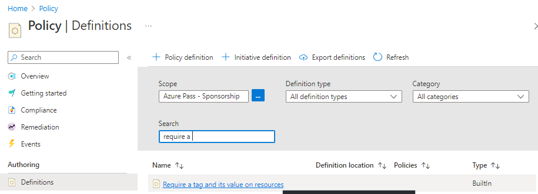
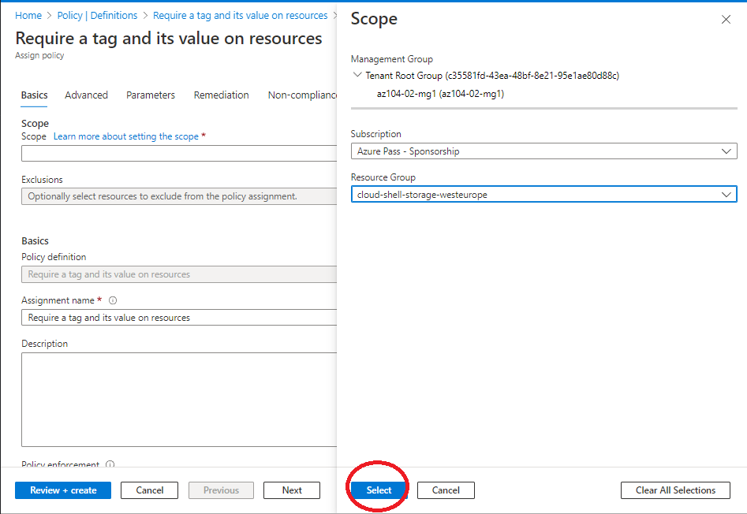
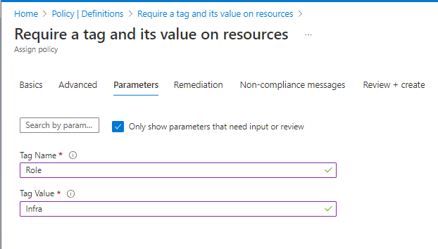
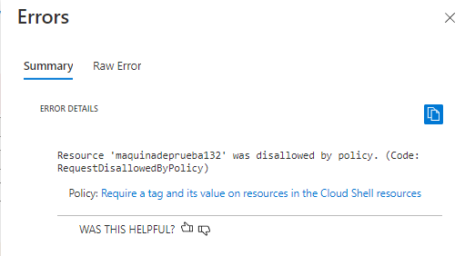

# Lab02B: Administrar la gobernanza a través de Azure Policy

Para mejorar la administración de los recursos de Azure en Contoso, realizarmeos la tarea de implementar la siguiente funcionalidad:

- Etiquetar grupos de recursos que incluyen solo recursos de infraestructura (como cuentas de almacenamiento de Cloud Shell).

- Garantizar que solo los recursos de infraestructura correctamente etiquetados se puedan agregar a los grupos de recursos de infraestructura.

- Remediar cualquier recurso no conforme.

  

## Objetivos

En este laboratorio, haremos lo siguiente:

- Tarea 1: crear y asignar etiquetas a través de Azure Portal

- Tarea 2: Hacer cumplir el etiquetado a través de una política de Azure

- Tarea 3: aplicar el etiquetado a través de una política de Azure

  

## Diagrama de arquitectura

## Instrucciones

### Ejercicio 1

#### Tarea 1: Asignar etiquetas a través de Azure Portal

En esta tarea, crearemos y asignaremos una etiqueta a un grupo de recursos de Azure a través de Azure Portal.

1. En Azure Portal, inicie una sesión de **PowerShell dentro de** **Cloud Shell** .

2. En el panel de Cloud Shell, ejecutaremos lo siguiente para identificar el nombre de la cuenta de almacenamiento que usa Cloud Shell:

   

   3. En el resultado del comando, tenemos que tener en cuenta la primera parte de la ruta completa que designa el montaje de la unidad principal de Cloud Shell.

   4. En Azure Portal, seleccionaremos **Cuentas de almacenamiento** y, en la lista de cuentas de almacenamiento, haremos clic en la entrada que representa la cuenta de almacenamiento que identificamos en el paso anterior.

   5. En la hoja de la cuenta de almacenamiento, haremos clic en el vínculo que representa el nombre del grupo de recursos que contiene la cuenta de almacenamiento.

   6. En la hoja del grupo de recursos, haremos clic en **editar** junto a **Etiquetas** para crear nuevas etiquetas.

      

      

      Crearemos una etiqueta con la siguiente configuración y aplique su cambio:

      | Entorno | Valor     |
      | :------ | :-------- |
      | Nombre  | **Role**  |
      | Valor   | **Infra** |

      7.  Volvemos a la hoja de la cuenta de almacenamiento. Revisaremos la información de **descripción general** y tenga en cuenta que la nueva etiqueta no se asignó automáticamente a la cuenta de almacenamiento.

         

         

      #### Tarea 2: Hacer cumplir el etiquetado a través de una política de Azure

      

      En esta tarea, se le asignará  la política *Requerir una etiqueta integrada y su valor en* los recursos al grupo de recursos y evaluará el resultado.

      1. En Azure Portal, busque y seleccione **Política** .

      2. En la sección **Creación , haremos clic en** **Definiciones** . 

      3. Buscaremos y haremos clic en la entrada que representa la política integrada **Requerir una etiqueta y su valor en los recursos** y revisaremos su definición.

      4. En la hoja de definición de política integrada **Requerir una etiqueta y su valor en los recursos , haga clic en** **Asignar** .

         

      5. Especificaremos el **Ámbito** haciendo clic en el botón de puntos suspensivos y seleccionando los siguientes valores:

         | Entorno           | Valor                                                        |
         | :---------------- | :----------------------------------------------------------- |
         | Suscripción       | el nombre de la suscripción de Azure que está utilizando en este laboratorio |
         | Grupo de recursos | el nombre del grupo de recursos que contiene la cuenta de Cloud Shell que identificó en la tarea anterior |

         

         

         Revisamos y creamos

         Volvemos al grupo de recursos e intentamos crear una nueva cuenta de almacenamiento/o cualquier recurso como comprobación.

         

         Al intentar implementar el recurso nos salta este error:

         {"code":"DeploymentFailed","message":"At least one resource deployment operation failed. Please list deployment operations for details. Please see https://aka.ms/DeployOperations for usage details.","details":[{"code":"RequestDisallowedByPolicy","message":"Resource 'raimostorage' was disallowed by policy. Policy identifiers: '... (Code: RequestDisallowedByPolicy)","policyDetails":[]}]}

         ### Tarea 3: Aplicar el etiquetado a través de una política de Azure

         ------

         A continuacion vamos aplicar los tagings mediante directivas

         ***Home>Buscar>Policy>Authoring>Assignments***

         Borramos el assignment que hay
